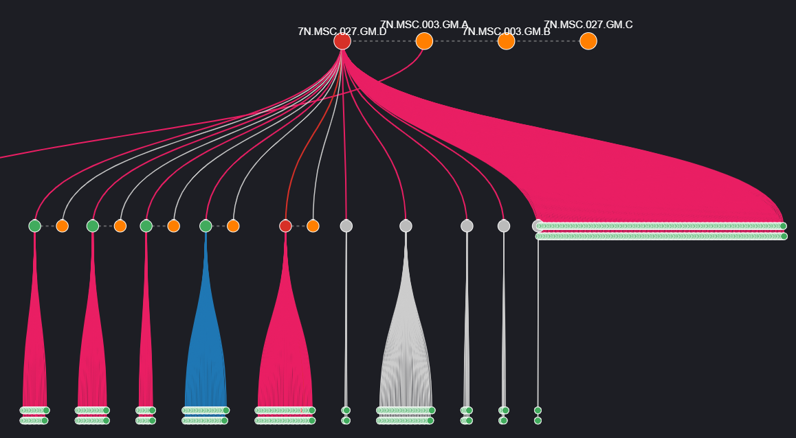

## PTP Monitor

ptpMon is designed for the MAGNUM-Analytics Poller application. This poller uses the cfgjsonrpc webeasy program to retrieve device PTP state. 

The following devices are currently supported with the following arg names:

  - 570IPG -> 570ipg
  - 570J2K -> 570j2k
  - 570ACO -> 570aco
  - 570EMR-ADMX -> 570admx
  - 9821-AG-HUB -> 9821aghub
  - evIPG-3G -> evIPG
  - SCORPION-6F -> scorpion6f
  - SCORPION-X18 -> scorpionx18
  - sVIP -> svip
  - 570TG-100G -> 570tg
  - evVIP-100G -> vip100g

### Prerequisites

- Magnum-ANALYTICS Version 11 or newer
- Python 3.5.2 or newer (already installed on Analytics HW)
- Python3 Requests Library (already installed on Analytics HW)

### Installation


1. Copy ptpMon.py script to the /pll-1/data/python/modules directory via WinSCP or Command Line:
    ```sh
    cp ptpMon.py /opt/evertz/insite/parasite/applications/pll-1/data/python/modules
    ```
**    NOTE:**
      If the directory does not exist, first configure an empty Python poller in the poller you are trying to add to.
      This will force the above directory to be created.

3. Copy the params folder to the same location as Step 1.

4. Restart the poller application


### Configuration
**NOTE: Configure one poller per device type.**

1. Once the module has been installed to the correct directory, navigate to the Poller application
2. Click the "+" icon at the top right> Custom Poller to open the poller creation menu
3. Enter a Name, Summary, and any relevant Description info
4. Enter the list of hosts to poll in the Hosts tab
5. In the Input tab, change the type to Python
6. In the Input tab, change the Metric Set Name field to "ptpmetrics"
7. From the Python tab, select the Advanced tab and enable the CPython Bindings option
8. Select the Script tab and paste the contents of poller_config.py into the panel.
9. Ensure the deviceType parameter matches one of the available deviceTypes defined in the poller config file.
10. Save changes, then restart the poller program


## Testing

The ptpMon.py script can be run manually from the terminal using the following command:

```sh
sudo python3 ptpMon.py
```

However, please note that the main function params will have to be modified. At the bottom you can modify the main block:

```
def main():

    params = {"hosts": ["yourDeviceIPhere"],  
              "deviceType": "yourDeviceTypeHere"}

    collector = ptpMon(**params)

    inputQuit = False

    while inputQuit is not "q":

        documents = []

        for host, params in collector.collect.items():

            document = {"fields": params, "host": host, "name": "ptpStatus"}

            documents.append(document)

        print(json.dumps(documents, indent=1))

        inputQuit = input("\nType q to quit or just hit enter: ")


if __name__ == "__main__":
    main()
```


## PTP Topology Visualization

The `visualizations/ptp-vis.ndjson` file contains a Kibana Vega visualization that renders the PTP synchronization topology as an interactive tree — grandmasters at the top, branching down through boundary clocks/masters to their slaves. It is driven by the `ptpStatus` documents this poller emits, so it gives an at-a-glance view of sync health across the fleet.



### Importing the Visualization

1. In Kibana, open **Stack Management > Saved Objects**.
2. Click **Import**.
3. Select the `visualizations/ptp-vis.ndjson` file.
4. Confirm the import. The visualization will appear in your Saved Objects list and can be opened or added to a dashboard.

### Editing the Visualization

Devices that should appear as fixed nodes in the topology (grandmasters and master/boundary clocks) are defined in the `manual_names` data block inside the Vega spec. You can edit this block in one of two places:

- **In Kibana (Recommended):** open the visualization, switch to the Vega editor panel, and find the `manual_names` data block in the spec.
- **Before import:** open `visualizations/ptp-vis.ndjson` in a text editor and locate the `manual_names` `values` array.

Each entry maps one device's MAC addresses to a display name, a group, and a role:

```json
{
  "ids": [
    { "mac": "00-02-C5-FF-FE-24-0B-3C", "side": "RED" },
    { "mac": "00-02-C5-FF-FE-24-0B-3D", "side": "BLUE" }
  ],
  "name": "7N.MSC.003.GM.A",
  "group_id": "GM",
  "role": "grandmaster"
}
```

- **`ids`** — the device's clock identity MAC addresses. List one object per fabric, tagging each with `"side": "RED"` or `"side": "BLUE"` so the topology can color edges by fabric. A device with only one side simply lists one entry.
- **`name`** — the display name shown on the node (e.g. `7N.MSC.003.GM.A`).
- **`group_id`** — groups related devices together in the layout (e.g. all grandmasters share `"GM"`; a RED/BLUE master pair shares the same group).
- **`role`** — the device's position in the topology: `"grandmaster"` for top-level clocks or `"master"` for boundary clocks. Devices not listed here are placed automatically as slaves under the master they report.

To add or change a device, add a new entry (or edit an existing one) following the pattern above, then re-import the updated `.ndjson` via **Stack Management > Saved Objects** (or save directly from the Vega editor).

### Additional Data Sources for the Visualization

Beyond the `ptpStatus` documents emitted by this poller, the visualization enriches the clock nodes with port-state data from a separate index. This data source is optional — the topology renders without it — but it is required to display per-port status on the clock tooltips.

- **Index:** `log-metric-p-msc-*`
- **Fields:** `msc.snmp.s_port_1_state` through `msc.snmp.s_port_4_state` (ports 1–4)

These documents must be ingested into Elasticsearch (e.g. via a poller collecting MSC SNMP port states) and keyed by device name so the visualization can join them to the matching clock node. When present, hovering over a clock displays the state of each of its four ports in the tooltip. If the index is absent or a device has no matching document, the topology still renders and the tooltip simply omits or shows no data for the port rows.

## Performance Metrics

ptpMon emits a `ptpMonPerf` document alongside the `ptpStatus` documents each poll cycle. These metrics are indexed into Elasticsearch and can be visualized in Kibana to monitor poller health.

### Cycle-Level Metrics

| Metric | Description |
|---|---|
| `cycle_wall_s` | Total elapsed (real-world) time for the poll cycle in seconds. This is the start-to-finish duration including all network waiting, thread scheduling, and processing. If this approaches your poll cadence (e.g. 30s), the poller cannot keep up. |
| `cycle_cpu_s` | CPU time consumed by the poll cycle in seconds. This counts only time the processor was actively doing work — it excludes time spent waiting on network I/O. A large gap between `cycle_wall_s` and `cycle_cpu_s` indicates the cycle is I/O-bound (expected). |
| `cycle_user_s` | User-space CPU time (subset of `cycle_cpu_s`). Time spent in Python code, JSON parsing, and TLS processing. |
| `cycle_sys_s` | Kernel CPU time (subset of `cycle_cpu_s`). Time spent in system calls — socket operations, thread scheduling. |
| `peak_rss_kb` | Peak resident set size (memory) of the poller process in kilobytes. Watch for steady growth across cycles, which would indicate a memory leak. |
| `active_threads` | Number of active threads at cycle end. Should stay near `max_workers` and not grow cycle-over-cycle. |

### Request Counters

| Metric | Description |
|---|---|
| `http_probes` | Number of HTTP discovery requests (protocol detection + endpoint detection) made during the cycle. On the first cycle this will be ~2× the host count. On subsequent cycles with a warm endpoint cache, this should drop to near zero. |
| `http_rpcs` | Number of JSON-RPC data requests made during the cycle. This is always equal to the host count — one RPC per host per cycle. |
| `errors` | Number of hosts that returned an error during the cycle. |
| `endpoint_cache_hit_ratio` | Fraction of hosts that used cached endpoint discovery results (0.0 to 1.0). Should reach 1.0 by cycle 2 under normal conditions. A drop indicates hosts changed protocol/endpoint or were evicted from the cache due to errors. |

### Per-Host Latency Percentiles

These break down where time is spent per host, aggregated across all hosts in the cycle. Percentile values (p50, p95, p99, max) are reported in milliseconds.

| Metric | Description |
|---|---|
| `per_host_total_ms` | Total time to poll a single host (probe + RPC + parse). The p95 value is the most useful for capacity planning — it represents the typical worst-case per-host cost. |
| `per_host_proto_ms` | Time spent detecting whether the host uses HTTP or HTTPS. Zero on cache-warm cycles. |
| `per_host_endpoint_ms` | Time spent discovering whether the host uses `/cfgjsonrpc` or `/delegate`. Zero on cache-warm cycles. |
| `per_host_rpc_ms` | Time spent on the actual JSON-RPC data request. This is the irreducible cost per host — it cannot be cached or eliminated. |

### Interpreting the Metrics

- **Healthy steady state:** `endpoint_cache_hit_ratio` at 1.0, `http_probes` near 0, `cycle_wall_s` well under your poll cadence.
- **First cycle after restart:** `endpoint_cache_hit_ratio` will be 0.0 and `http_probes` will be high as the cache is cold. This is expected — performance should stabilize by cycle 2.
- **CPU saturation warning:** If `cycle_cpu_s` approaches `cycle_wall_s`, the poller is CPU-bound rather than I/O-bound. Consider reducing `maxWorkers` or splitting the host list across multiple pollers.
- **Cadence pressure:** If `cycle_wall_s` approaches the poll interval (e.g. 30s), the poller cannot complete a cycle before the next one is due. Check `per_host_rpc_ms_p95` for slow hosts or increase `maxWorkers`.
